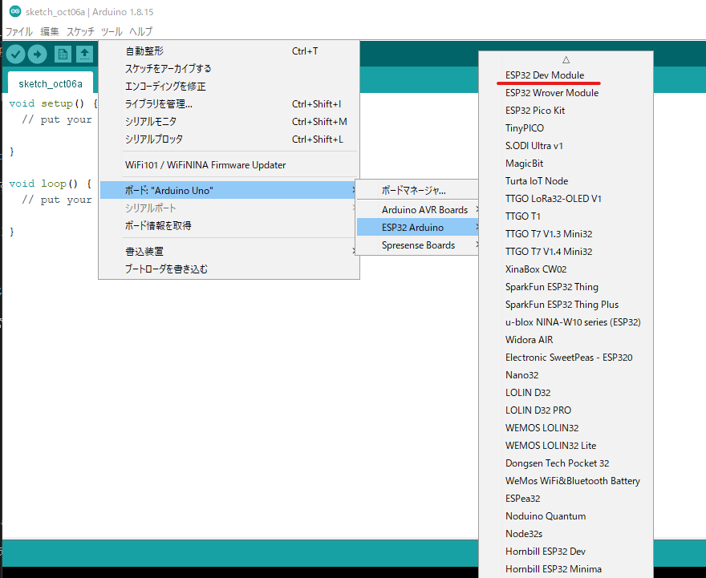

# IoTシステムの構築とその活用

# 基本セットアップ

IDE, ESP32 Devkit-C 等の環境構築を行います．

## 利用ハードおよびサービス

- ESP32-DevKitC-32E
  - https://akizukidenshi.com/catalog/g/gM-15673/
- ESP32-WROVER-E
  - https://akizukidenshi.com/catalog/g/gM-15674/
- Raspberry Pi 4 modelB
    - https://www.raspberrypi.org/products/raspberry-pi-4-model-b/
    - 共立エレショップ　スターターキット
      - https://eleshop.jp/shop/g/gJC5317/
- Raspberry Pi 400
  - https://www.raspberrypi.com/products/raspberry-pi-400/
- Node-Red
  - https://nodered.org/
  - 日本コミュニティ
    - https://nodered.jp/

## IDE

Arduino IDEのセットアップ．下記のアドレスからソフトウェアをダウンロード，インストールを行います．

- Arduino IDE
  - https://www.arduino.cc/en/Main/Software

## ESP32-DevKitCの環境構築

Arduino IDEでESP32を利用するための環境構築を行います．

### USBドライバのインストール

Silicon Labs CP210x driverを以下のアドレスよりダウンロードしてインストールします.

- [Windows](https://www.silabs.com/documents/public/software/CP210x_VCP_Windows.zip)
- [macOS](https://www.silabs.com/documents/public/software/Mac_OSX_VCP_Driver.zip)
- [Linux](https://m5stack.oss-cn-shenzhen.aliyuncs.com/resource/drivers/CP210x_VCP_Linux.zip)

    

### Arduino IDEセットアップ

#### ESP32 ボードマネージャの追加

Arduino IDE内の環境設定における追加ボードマネージャに記述するアドレスは以下となります

- Arduino-ESP32 Support
  - `https://dl.espressif.com/dl/package_esp32_index.json`

    

ツールメニューよりボードマネージャを選択し，`esp32` で検索を行います．
検索結果から，`esp32 by Espressif Systems` のパッケージをインストールします．

    

#### ESP32デバイスに応じたボードの選択

`ESP32 Dev Module` 等，自身が利用するデバイスに合わせてボードを選択します．

> 本演習(2025年度)では，ボードの設定で `ESP32 Wrover Module` を選択します

    

## 利用するArduino用ライブラリ

### タイマライブラリ

- Ticker
  - ライブラリ検索で追加
  - https://github.com/sstaub/Ticker

### BME280センサ(温度・湿度・気圧計測)ライブラリ

- SparkFun BME280 Arduino Library
  - ライブラリ検索で追加
  - https://github.com/sparkfun/SparkFun_BME280_Arduino_Library

### MQTTプロトコルによる通信用ライブラリ

- PubSubClient
  - ライブラリ検索で追加
  - https://pubsubclient.knolleary.net/

- ArduinoJson
  - ライブラリ検索で追加
  - https://arduinojson.org

