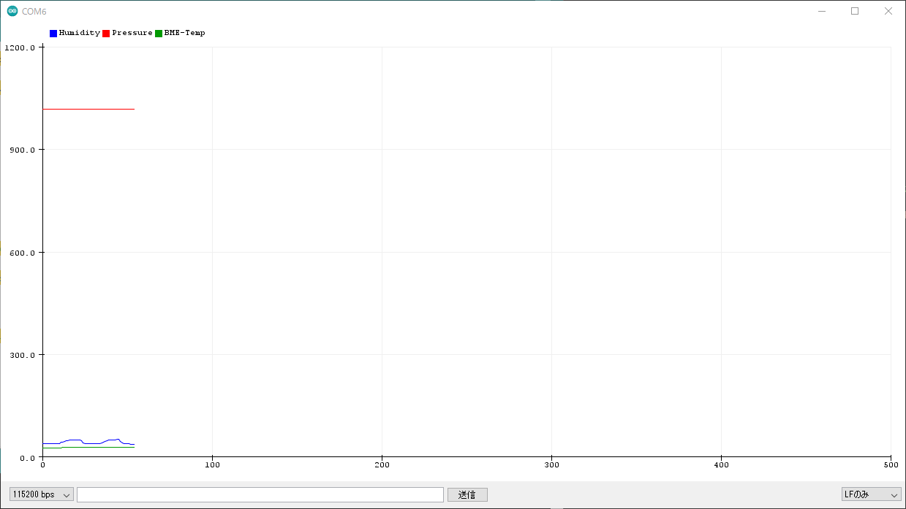

# IoTシステムの構築とその応用


## ESP32-DevKitCについて

ESP32-DevKitC-32DはESP-WROOM-32Eを搭載した開発用評価ボードです．

手軽にESP32を利用することができ，[ESP32-WROOM-32E](https://www.espressif.com/sites/default/files/documentation/esp32-wroom-32e_esp32-wroom-32ue_datasheet_en.pdf)モジュールには，Wi-FiとBluetoothの通信機能が内蔵されています．開発環境として，Arduino IDEを使う方法，ESP-IDFという専用の開発環境を使用する方法の他に，MicroPythonによる開発が可能です．

### [主な特徴](https://docs.espressif.com/projects/esp-idf/en/latest/esp32/hw-reference/esp32/get-started-devkitc.html)

- IEEE 802.11b/g/nに対応（2.4 GHz）
- Bluetooth Classic及びBLE（4.2）に対応（デュアルモード）
- 低消費電力の32 bit デュアルコアMCUを搭載
- 12 bit SAR A/Dコンバータを搭載
- TCP/IPのプロトコルスタックを搭載
- (H)SPI、UART、I2C、I2S、PWM、GPIOなどさまざまなインターフェースを搭載


 ### 仕様

- SoC：ESP32（Tensilica LX6 デュアルコア、240 MHz）
- Wi-Fi：802.11 b/g/n（HT40）
- Bluetooth：Classic、BLE 4.2（デュアルモード）
- Wi-Fiモード：Station/softAP/SoftAP+station/P2P
- セキュリティ：WPA/WPA2/WPA2-エンタープライズ/WPS
- 暗号化：AES/RSA/ECC/SHA
- SRAM：520 KB
- フラッシュ：4 MB
- 動作電圧：2.2～3.6 V
- 消費電流：平均80 mA
- 動作温度：-40℃～+85°C
- オンチップセンサ：ホールセンサ、温度センサ
- インターフェース
  - GPIO
  - I2C
  - UART
  - SPI
  - モータ用PWM
  - LED用PWM
  - I2S
  - ADC
  - DAC
  - SDカード（SDIO）
  - IR
  - 静電容量式タッチセンサ
  - ローノイズプリアンプ


### ピン配置

ピンレイアウトは下図の通りとなる．


<center>
    
</center>


## オンチップ温度の取得

1秒毎に内蔵の温度センサ・ホールセンサの情報を取得してシリアルへ出力を行います．

- 内蔵温度センサ
  - temperatureRead()
- 内蔵ホールセンサ
  - hallRead()


```c

#include <Ticker.h>

// Timer event
Ticker tickerInternal;

void displayInternalSensorData() {
  Serial.println("Temp, Hall");
  Serial.print(temperatureRead());
  Serial.print(",");
  Serial.println( hallRead());
  yield();
}


void setup() {

  Serial.begin(115200);

  tickerInternal.attach_ms(1000, displayInternalSensorData);

}


void loop() {

}

```


プログラムをコンパイル・転送を行い，シリアルプロッターで起動を確認する．

<center>
    
</center>


## BME280センサデータの取得

BME280センサーをESP32にI2C接続を行いデータを取得する


### ESP32とBME280との接続

|信号名|AE-BME280|ESP32 GPIO|
|:-:|:-:|:-:|
|SCL|SCK|22|
|SDA|SDI|21|
|(アドレス選択)|SDO|(3.3V)|
|(電源/VDD)|VDD|(3.3V)|
|(電源/GND)|GND|(GND)|

### Arduino  Code


```c

#include <Ticker.h>
#include <Wire.h>
#include <SparkFunBME280.h>

// Timer event
Ticker tickerBME280;

// BME280

BME280 bme;
BME280_SensorMeasurements measurements;


void displayBME280SensorData() {
  bme.readAllMeasurements(&measurements); 
  Serial.println("Humidity,Pressure,BME-Temp");
  Serial.print(measurements.humidity, 0);
  Serial.print(",");
  Serial.print(measurements.pressure/100, 2);
  Serial.print(",");
  Serial.println(measurements.temperature, 2);
  yield();
}


void setup() {

  Serial.begin(115200);

  Wire.begin();

  if (bme.beginI2C() == false) //Begin communication over I2C
  {
    Serial.println("The sensor did not respond. Please check wiring.");
    while (1); //Freeze
  }

  tickerBME280.attach_ms(1000, displayBME280SensorData);

}


void loop() {

}

```

プログラムをコンパイル・転送を行い，シリアルプロッターで起動を確認する．

<center>
    
</center>

