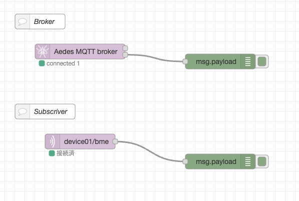

# IoTシステムの構築とその応用


## Node-Redのセットアップ

Raspberry Piをゲートウェイの役割を持たせるために，Node-Redのセットアップを行います

ターミナルを起動し，下記のコマンドを入力します．

- 参考: [Running on Raspberry Pi](https://nodered.org/docs/getting-started/raspberrypi)


aptコマンドで，開発に必要なパッケージをインストールします．

```shell
$ sudo apt install build-essential git curl
```

Node-Redのインストールを行います．

```shell
$ bash <(curl -sL https://raw.githubusercontent.com/node-red/linux-installers/master/deb/update-nodejs-and-nodered)
```

以下の2つの質問があります．
- `Are you really sure you want to do this ? [y/N] ?` 
- `Would you like to install the Pi-specific nodes ? [y/N] ?`  

いずれも `y` と入力してインストールを継続します．

## Node-Redの起動と終了

### 起動方法

```shell
$ node-red-start
```

同一ネットワーク内からブラウザで，http://\[Raspberry PiのIPアドレス\]:1880 でアクセスします.

### 終了方法

終了はターミナルで `Ctrl+C` キーを押し，tracebackを停止します．
しかし，バックグラウンドで起動し続けているので， `node-red-stop` コマンドを入力します．

```shell
$ node-red-stop
```


## Node-Redの画面構成

<center>
  
</center>

Node-REDは，Flowエリアにノードパレットからノードをドラッグ＆ドロップし，ノード間をつなぐことで機能を組み立てていきます.


## MQTTブローカーのセットアップ

Raspberry Pi へMQTTブローカー機能を追加する．


利用ライブラリは以下

- node-red-contrib-aedes
    - node-red-contrib-aedes (node) - Node-RED (nodered.org)

### インストールは，ターミナルで行う．

```shell
$ cd ~
$ cd .node-red
$ npm install node-red-contrib-aedes
$ cd ~
```

## node-redの起動

ターミナルで `node-red` コマンドを入力して起動する

```shell
$ node-red-start
```

フロー内に`Aedes MQTT broker`ノードを追加しDeploy後，ブローカが正常に起動すればターミナルにmqtt://～～と表示される
```dotnetcli
6 Jul 11:59:28 - [info] Starting flows
6 Jul 11:59:28 - [info] Started flows
6 Jul 11:59:28 - [info] [aedes broker:5c318b9b.0588e4] Binding aedes mqtt server on port: 1883
6 Jul 11:59:29 - [info] [mqtt-broker:e345b3f7.76475] Connected to broker: mqtt://localhost:1883
```


## 今回のデータフロー

データフローは下図となる．今回はTopicを `[device_id]/bme` とし，ESP32がpublisherとなりデータの送信を行い，node-red側のsubcriberノードを用いてデータの取得を行う．

<center>
  
</center>


## node-redによるMQTT通信


ブラウザで `http://[node-red IP-address]:1880` へアクセスする．

### 次のノードを配置して，BrokerとSubscriberを有効にする．

<center>
    
</center>

### 各ノードの設置内容は以下
- MQTT Broker
    - デフォルトのままでOK
- mqtt in
    - server
        - `localhost:1883`
    - topic
        - `[device_id]/bme`
            - 画像では，`device01/bme`となっている．

###  `デプロイ` ボタンをクリックしノードを有効化する