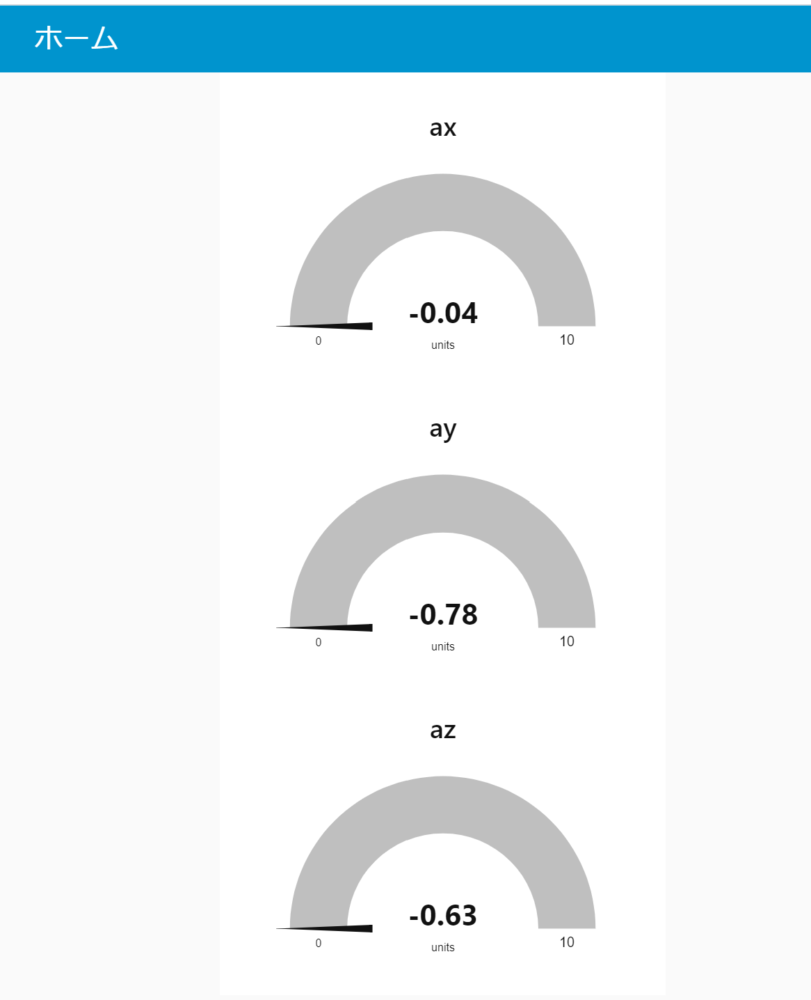

# IoTシステムの構築とその応用

## ESP32をPublisherにして，センサ情報を送信する

以下のコードは，MQTTブローカへBME280センサで取得したデータを送信します．

```c
#include <PubSubClient.h>
#include <ArduinoJson.h>
#include <SparkFunBME280.h>

// WiFi
#include <WiFi.h>
#include <time.h>

// wifi config
#define WIFI_SSID "{WiFiSSID}" 
#define WIFI_PASSWORD "{WiFiパスワード}"

// MQTT config
#define MQTT_SERVER "{Raspi IPアドレス}"
#define MQTT_PORT 1883
#define MQTT_BUFFER_SIZE 128
#define TOPIC "device01/bme"

// デバイスID　デバイスIDは機器ごとにユニークにします
#define DEVICE_ID "esp001"

// BME280
BME280 bme;
BME280_SensorMeasurements measurements;

// Ticker
#include <Ticker.h>
Ticker tickerMeasure;

// MQTT Publish
const int message_capacity = JSON_OBJECT_SIZE(3);
StaticJsonDocument<message_capacity> json_message;
char message_buffer[MQTT_BUFFER_SIZE];

// MQTT用インスタンス作成
WiFiClient espClient;
PubSubClient client(espClient);


// WiFiへの接続
void setupWiFi() {
  // connect wifi
  WiFi.begin(WIFI_SSID, WIFI_PASSWORD);
  while (WiFi.status() != WL_CONNECTED) {
    Serial.println(".");
    delay(100);
  }

  Serial.println("");
  Serial.print("Connected : ");
  Serial.println(WiFi.localIP());
  // sync Time
  configTime( 3600L * 9, 0, "ntp.nict.jp", "ntp.jst.mfeed.ad.jp");

  // MQTTブローカに接続
  client.setServer(MQTT_SERVER, MQTT_PORT);

  // 5sごとにセンサデータを送信する
  tickerMeasure.attach_ms(5000, sendSensorData);

}


void sendSensorData(void) {
  //センサからデータの取得
  bme.readAllMeasurements(&measurements);
  Serial.println("Humidity,Pressure,BME-Temp");
  Serial.print(measurements.humidity, 0);
  Serial.print(",");
  Serial.print(measurements.pressure / 100, 2);
  Serial.print(",");
  Serial.println(measurements.temperature, 2);

  // ペイロードを作成して送信を行う．
  json_message.clear();
  json_message["humid"] = measurements.humidity;
  json_message["press"] = measurements.pressure / 100;
  json_message["temp"] = measurements.temperature;
  serializeJson(json_message, message_buffer, sizeof(message_buffer));
  client.publish(TOPIC, message_buffer);
}


void setup() {
  Serial.begin(115200);

  Wire.begin();
  bme.setI2CAddress(0x77);  // I2C address {0x76 or 0x77}
  if (bme.beginI2C() == false) //Begin communication over I2C
  {
    Serial.println("The sensor did not respond. Please check wiring.");
    while (1); //Freeze
  }

  // WiFi接続
  setupWiFi();
}

void loop() {
  client.loop();
  // MQTT未接続の場合は，再接続
  while (!client.connected() ) {
    Serial.println("Mqtt Reconnecting");
    if ( client.connect(DEVICE_ID) ) {
      Serial.println("Mqtt Connected");
      break;
    }
    delay(1000);
  }
}

```


プログラムをコンパイル・転送を行い，シリアルモニターで起動を確認する．


## node-red ダッシュボード機能

`node-red-dashboard` を利用することで容易にダッシュボードを作成することが可能となる．

### `node-red-dashboard` ノードの追加

パレットの管理から，ノードを追加を選択して，`node-red-dashboard` を検索し追加を行う．


### ダッシュボードの例

次の図は，ESP32 より送信した データをゲージ表示したものである． 

<center>
    
</center>


# Node-REDを用いた　OLEDディスプレイへの表示

各種センサデータをOLEDディスプレイに表示します．

## OLEDディスプレイのセットアップ

OLEDディスプレイをRaspberry Pi 400に接続します．

 [Raspberry Pi GPIO Pinout](https://github.com/raspberrypi/documentation/blob/develop/documentation/asciidoc/computers/raspberry-pi/gpio-on-raspberry-pi.adoc#gpio-and-the-40-pin-header)

- SDA -> GPIO 2
- SCL -> GPIO 3
- VDD -> 3.3V
- GND -> GND


## node-red-contrib-oled-i2cのインストール

Node-REDのパッケージマネージャを利用して，OLEDディスプレイの表示を行うためのパッケージをインストールします．

```shell
$ cd ~/.node-red
$ npm install node-red-contrib-oled-i2c
$ cd ~
```

## OLEDディスプレイの表示

OLEDディスプレイに表示するためのFlowを作成します．

- Driverは `ssd1306` を選択します．
- I2C Addressは `0x3c` を選択します．


### サンプルフロー

- https://github.com/hadifikri/node-red-contrib-oled-i2c/tree/main/examples
